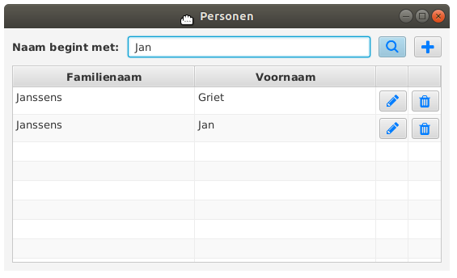
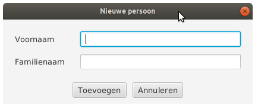
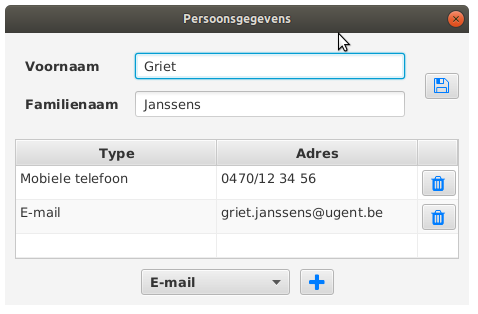
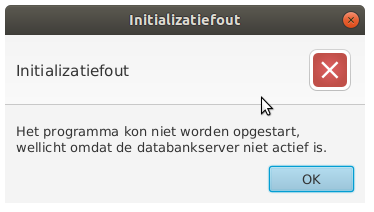

Een GUI voor de contacts-databank
===

**Vooraf** Deze oefening combineert heel wat verschillende onderwerpen uit de cursus. Het is daarom belangrijk dat je
die volledig afwerkt, ook al heb je daarvoor niet voldoende tijd tijdens
de oefeningenzittingen. Dit is wellicht een goede voorbereiding op het examen.

Opgave
---

We maken een GUI in JavaFX waarmee de `contacts`-databank uit de lesvoorbeelden
kan worden beheerd. De GUI bestaat uit een aantal vensters.

### Hoofdvenster

Dit zijn de acties die je kan uitvoeren:

* Wanneer je in het tekstveld het begin van een familienaam invult en op de zoek-knop
drukt (het vergrootglas), wordt de getoonde lijst leeggemaakt en ingevuld
met alle personen in de databank wiens familienaam met de gegeven string begint.
* Hetzelfde gebeurt wanneer je op de Enter-toets drukt in het tekstveld. M.a.w., de zoek-knop is
de *default*-knop voor het venster.
* De plus-knop rechts bovenaan opent een nieuw venster waarmee je een 
persoon aan de databank kan toevoegen. (Zie verder.)
* Druk je in de lijst op het vuilnisbak-knopje, dan verwijdert dit de corresponderende 
persoon uit de databank - en uit de lijst.
* Druk je in de lijst op het potlood-knopje, dan verschijnt er een venster met meer informatie over
deze persoon en zijn contactgevens. (Zie verder.)
* Dit gebeurt ook wanneer je op de betreffende rij in de lijst dubbelklikt.

### Nieuwe persoon

Vul familienaam en voornaam in en druk op 'Toevoegen' om een nieuwe persoon toe
te voegen aan de databank. Deze persoon wordt ook achteraan toegevoegd
aan de lijst in het hoofdvenster. 

Het venster sluit na het indrukken van de knop. Het venster sluit ook na het indrukken
van de 'Annuleren'-knop maar dan zonder iets aan de databank of het hoofdvenster te wijzigen.
 
### Contactgegevens

Dit venster toont alle gegevens van één persoon uit de databank. Bovenaan staan naam en voornaam, onderaan
staan alle contactgegevens voor die persoon. Dit zijn de corresponderende acties:

* Wijzig de naam en/of voornaam en druk op de 'bewaar'-knop (rechtsboven) om deze wijzigingen
door te geven aan de databank.
* De 'Adres'-kolom is *editeerbaar*: dubbelklikken op een adresveld in de lijst laat toe om dit te veranderen.
Wanneer je dan op Enter drukt, worden deze wijzigingen meteen rechtstreeks in de databank aangepast.
* Contactgegevens toevoegen doe je door in de *choice box* het contacttype in te stellen en daarna op de
'plus'-knop te drukken. Het effect hiervan is dat er onmiddellijk een nieuwe rij aan de lijst
wordt toegevoegd  (en in de databank!) van het juiste contacttype en met een blanco adres, dat je dan op de gebruikelijke manier
kan editeren.  
* Wissen van contactgevens doe je met het vuilnisbak-knopje.

### Opmerkingen

* De twee hulpvensters zijn *modaal*: je kan het hoofdvenster niet gebruiken zolang het hulpvenster niet is gesloten.
* Alle knoppen hebben een 'tooltip' met een korte tekst die aangeeft wat die knop doet. 

Tips
---

### Vooraf

Maak een nieuw project aan en kopieer daarin de broncode van 
het pakket `prog2.contacts` uit de lesvoorbeelden. Het deelpakket `prog2.contacts.test` heb je niet nodig.

De knop-afbeeldingen kan je
[hier](icons.zip?raw=true) ophalen.

De lesvoorbeelden bevatten [uitleg](https://github.ugent.be/kcoolsae/Prog2/blob/master/etc/Readme.md) over hoe je
de databank kunt opzetten en opvullen met gegevens.

Gebruik de DAO's uit `prog2.contacts` zoals aangegeven in de les en in de cursusnota's. Maak
slechts één `DataAccessProvider`-object aan en sla dit bijvoorbeeld op als veld van de partnerklasse
van het hoofdvenster, dus niet in een (statische) klassenvariabele!

### Hoofdvenster

* Zorg eerst voor de zoek-functionaliteit. Maak je nog niet druk over de knoppen in de lijst/tabel.
* Voeg daarna de knoppen toe aan de lijst/tabel (de kolommen zijn 40 pixels breed). Je kan hiervoor een standaard `TableCell`
gebruiken, zonder tekst en waarvan de 'graphic' de bewuste knop is.
* De wis-knop is wellicht het meest eenvoudig te implementeren.
* Wacht met de edit-knop totdat je het toevoegen van een nieuwe persoon hebt geïmplementeerd.

### Nieuwe persoon

* De belangrijkste moeilijkheid is hier wellicht dat de partnerklasse moet toegang krijgen tot
de data access provider van het hoofdvenster.
* En dat je, nadat een nieuwe persoon aan de databank is toegevoegd, je die persoon ook aan de tabel
uit het hoofdvenster moet toevoegen
* Maak niet telkens een nieuw venster aan telkens wanneer er op de plus-knop gedrukt wordt.
Maak het venster op voorhand slechts één keer aan en laat telkens hetzelfde venster te voorschijn
komen en weer verdwijnen.

### Venster met contactgegevens

* Maak eerst een versie
   met een niet-editeerbare tabel en laat eventueel de combobox onderaan voorlopig weg.
* Wanneer je op de edit-knop drukt in het hoofdvenster, moet de juiste familienaam en voornaam
 in het venster zijn ingevuld wanneer dit hulpvenster verschijnt. En de juiste contactgegevens.
* Maak, zoals bij het andere hulpvenster, niet telkens een nieuw venster aan wanneer er op een
edit-knop gedrukt wordt, maar gebruik hetzelfde venster telkens weer opnieuw.
* De bovenkant van dit venster bevat dezelfde componenten (2 labels en 2 tekstvelden) als
het andere hulpvenster. Vermijd om dit te knippen en te plakken.
* Implementeer de update-knop.
* Maak de adreskolom editeerbaar, en zorg dat wijzigingen direct in de databank worden opgenomen. (Luisteren 
naar 'commit edit' lijkt ons hier de gemakkelijkste methode.)
* Zorg dat de combobox is ingevuld met de verschillende contacttypes. Haal
 de juiste contacttypes uit de databank - ze mogen niet hard gecodeerd staan in het programma of
 in het FXML-bestand!
* Implementeer het toevoegen van nieuwe contactgegevens.  
* Als je dat nog niet gedaan hebt: implementeer het dubbelklikken op een rij in het hoofdvenster.

 
### Afwerken

Internationaliseer het programma:
* Sla alle Nederlandstalige berichten, hoofdingen, tootips, e.d., op in
een *resource bundle*
* Geen enkele van deze berichten mag nog hard gecodeerd in de Java-bestanden
voorkomen
* En ook niet in de FXML-bestanden (zie cursus)
* IntellIJ Idea kan je hierbij helpen
* (De namen van de contacttypes kunnen niet geïnternationaliseerd worden - die komen uit de databank.)

Wanneer de databankverbinding niet werkt...
* toon je een JavaFX *Alert*-venster met een passend (geïnternationaliseerd) bericht.

