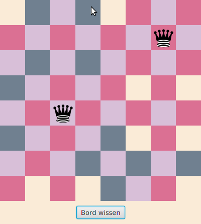

# Acht koninginnen

Vertrek voor deze oefening van het IDEA-project [eightqueens.zip](eightqueens.zip?raw=true)

De oefening bestaat erin om de broncode voor de klasse _EightQueensModel_ in te vullen. 
Je mag de andere bestanden niet wijzigen.

## Het probleem van de 8 koninginnen

Een _koningin_ (of dame) is een schaakstuk dat elk ander stuk kan slaan dat op 
dezelfde rij staat, op dezelfde kolom of op dezelfde diagonaal (in 2 richtingen). 
Het probleem van de acht koninginnen luidt als volgt:

* Hoe moet je 8 koninginnen op een 8x8 schaakbord plaatsen zodat geen enkele koningin een andere koningin kan slaan?

We schreven een grafisch hulpmiddel om deze puzzel te helpen oplossen.
Het JavaFX-programma beeldt een 8x8 schaakbord af in geelgrijze tinten. 
De gebruiker kan op elk van de velden klikken met de muis.

* Klik je op een geel of grijs vakje, dan verschijnt er een koningin op dit vakje, en 
  worden alle vakjes die door deze koningin worden aangevallen rozerood gekleurd.
* Wanneer je op een koningin klikt, wordt deze van het schaakbord verwijderd en 
  worden de rozerode velden dienovereenkomstig aangepast.
* Wanneer je op een rozerood  vakje klikt zonder koningin gebeurt er niets.
* Onderaan is er ook nog een knop die alle vakjes terug leeg maakt.

## Structuur van de toepassing

De toepassing heeft een structuur die voor een beginner niet meteen voor de hand ligt, maar die bij GUI-programma's 
vaak wordt gebruikt. (Het zogenaamde _model view controller_-patroon)
We geven hieronder een klein woordje uitleg - meer informatie vind je in het broncodecommentaar, en in nood ook in
hoofdstuk 5 van de cursusnota's.

De toepassing is een wisselwerking tussen verschillende objecten:
 
* Een object van de klasse _EightQueensModel_ - verder het _model_ genoemd
* De vierenzestig velden van het schaakbord die allemaal de interface _EightQueensListener_ implementeren - verder 
de _luisteraars_ genoemd. 
* Een knop waarmee het schaakbord wordt leeggemaakt. Dit is een zogenaamde _controller_ omdat hij zal inwerken op
het model. De vierenzestig velden van het schaakbord zijn tegelijk ook _controllers_, omdat je het model bewerkt door
er met de muis op te klikken.
* Tenslotte is er ook een klasse _EightQueensPanel_ die de inhoud van het venster voor zijn rekening neemt door model, 
luisteraars en controllers met elkaar te laten samenwerken.

Het model anderzijds houdt bij wat er precies in het venster te zien is: waar de koninginnen staan en welke vakjes 
rozerood zijn en welke niet. Voor deze opgave moet je enkel het model implementeren - de rest is reeds voorgeprogrammeerd.

## Werking van het programma

Wanneer het programma opstart, wordt niet alleen de zichtbare _user interface_ gecreëerd, maar wordt er ook een model
aangemaakt, en belangrijk, registreren alle luisteraars zichzelf bij dit model door de methode _registerListener_ van het model 
op te roepen. (Alles is reeds voorgeprogrammeerd, je hoeft enkel zelf de methode  _registerListener_ te schrijven.)

Telkens wanneer de _user interface_ (verder afgekort tot _UI_)
het schaakbord om één of andere reden op het scherm wil (her)tekenen, vraagt het informatie aan het model over wat er 
precies moet worden afgebeeld. Dit gebeurt met behulp van de methoden _containsQueen_ en _isThreatened_.

Wanneer de gebruiker op een veld klikt en er een koningin moet worden toegevoegd of verwijderd, signaleert de UI 
dit aan het model door de methode _toggleQueen_ op te roepen. En analoog, wanneer de gebruiker op de 'Bord wissen'-knop 
drukt, wordt de methode _cleanAll_ geactiveerd.

Het is bovendien de bedoeling dat het model  elke wijziging aan het schaakbord (als gevolg van _cleanAll_ of 
_toggleQueen_ bijvoorbeeld) aan al zijn geregistreerde luisteraars meldt door de methode _modelHasChanged_ van die 
luisteraars op te roepen.

## Opgave

Implementeer de klasse _EightQueensModel_ zodat ze aan bovenstaande beschrijving voldoet. De versie van deze klasse die
je van ons cadeau krijgt, compileert wel, maar doet niets. 

Zorg er eerst voor dat er koninginnen op het schaakbord
kunnen worden geplaatst en terug verwijderd. Programmeer pas later de roderoze  velden.

**Belangrijk.** Verander enkel iets aan de klasse _EightQueensModel_. Laat alle andere klassen ongemoeid!