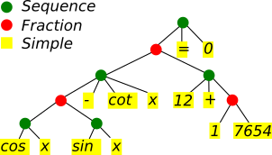
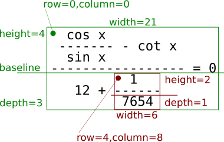

# Breuken afdrukken

Deze opgave gaat over het gebruik van *recursieve* structuren
en *recursieve* methoden - technieken die we in het vak 
*Objectgericht Programmeren* af en toe zullen toepassen, ook al staan die 
niet expliciet in de cursus beschreven. (Recursie = een methode roept zichzelf op met andere parameters of op een ander object.)

Op het eerste zicht lijkt deze opgave niet zo eenvoudig, maar je 
krijgt heel wat code cadeau en je kan een stappenplan volgen. Lees goed de 
beschrijvingen hieronder - zo vermijd je nutteloos werk.

Vertrek van [deze broncode](fractions-start.zip?raw=true) (let op: dit zijn enkel de Java-bestanden, binnen in een package genaamd *fractions*. 
Je moet zelf een IDEA-project aanmaken (Java - *niet* JavaFX) en er de bestanden in plaatsen.

## Opgave

Schrijf een Java-programma waarmee je formules zoals onderstaande kan afdrukken

      cos x
     ------- - cot x
      sin x
    ----------------- = 0
              1
       12 + ------
             7654
             
Bovenstaande voorbeeld werd afgedrukt vanaf de opdrachtlijn, met de volgende opdracht

    C:\TEMP\> java -jar fractions.jar "{{cos x}/{sin x} - cot x}/{12 + 1/7654} = 0"
    
We geven de formule aan het programma mee als parameter (= wat er tussen dubbele 
aanhalingstekens staat), in tekstuele vorm. Je krijgt een klasse *Parser* cadeau waarmee je een dergelijke
string kan omzetten naar de interne structuur van de formule.

## Interne structuur van een formule

Formules worden intern voorgesteld als 'bomen', zoals in onderstaande figuur.

Elke knoop in deze boom is een object van het type `Expression`, of meer specifiek van één van de klassen
`Simple`, `Sequence` of `Fraction`. De broncode van deze klassen is al gedeeltelijk ingevuld.

* Een object van de klasse `Simple` is weinig meer dan een string (zonder spaties)
* Een object van de klasse `Sequence` bevat een aantal *expressions* die naast elkaar moeten worden afgedrukt,
telkens gescheiden door een spatie.
* Een object van de klasse `Fraction` bevat een teller en noemer. Deze moeten boven elkaar worden afgedrukt, 
met ertussen een breukstreep die bestaat uit mintekens. De breukstreep is aan beide kanten één letterteken breder dan de teller
en noemer. Teller en noemer zijn horizontaal gecentreerd.

Bestudeer bovengenoemde klassen aandachtig zodat je goed begrijpt waarvoor ze dienen. (De uitleg 
hieronder zal je daarbij helpen.) Enkel de klasse `Parser` hoef je niet te bekijken (= leerstof 3e bachelor). 

## Afmetingen

Voor elke *expression* houden we een aantal afmetingen bij - zie figuur. Of liever: het is onze taak om deze afmetingen te berekenen.

 

Elk van die afmetingen is uitgedrukt in 'aantal lettertekens'. Meer info vind je in de broncode.

## Eerst

Het programma dat je van ons hebt gekregen, zou zonder fouten moeten compileren en 
uitgevoerd kunnen worden. Het neemt één opdrachtlijnparameter, zet deze string om naar een *expression* en drukt 
dan dit resultaat af met behulp van `toString`. Het resultaat bestaat uit één lijn die de structuur van de
boom weergeeft.

Vooraleer je verder leest, zorg je er eerst voor dat je erin slaagt om dit programma uit te voeren, en belangrijk, dat je weet hoe je
een opdrachtlijn parameter meegeeft, zoals `"1/3"` of `"{{cos x}/{sin x} - cot x}/{12 + 1/7654} = 0"`. (Opmerking: je hebt de aanhalingstekens
nodig zodra je een parameter gebruikt met spaties. De aanhalingstekens worden echter weggelaten vooraleer de parameter
aan het programma wordt doorgegeven.)

Er zijn twee mogelijkheden:
* Je kan het programma uitvoeren vanuit IntelliJ IDEA. Zoek uit (via het Internet - of in je lesnota's) hoe je in dat geval opdrachtlijnparameters
aan je programma kan meegeven.
* Je kan het programma omzetten naar een uitvoerbare 'jar' en dan uitvoeren zoals we in het begin van de opgave 
hebben geïllustreerd. Zoek uit (via het Internet - of in je lesnota's) hoe je IDEA een dergelijke 'jar' kunt laten maken.     
                 
Als bovenstaande lukt, mag je in de klasse `Main` de ene `System.out.println` vervangen door wat eronder in commentaar staat - dat
is het uiteindelijke hoofdprogramma dat we zullen gebruiken.
                
## Techniek

Zoals je in de nieuwe code van `Main` kunt zien, verloopt het afdrukken van een formule in de gevraagde vorm, in verschillende stappen.

**Opmerking** Programmeer de volgende stappen eerst enkel voor `Simple` en `Sequence` en kijk dan of het programma werkt. 
Voeg pas daarna `Fraction` toe. 

### 1. Bepaal de breedte

In een eerste stap geven we elke *expression* een geldige waarde voor `width` door de methode `computeWidth` te implementeren. De breedte van
een *expression* hangt af van het type van die *expression* en van de breedte van zijn 'kinderen'. Roep daarom als eerste stap in jouw 
implementatie van `computeWidth` de methode `computeWidth` op voor elk van zijn kinderen!

* De breedte van een *simple* is de lengte van de corresponderende string.
* De breedte van een *sequence* is de som van de breedten van zijn kinderen, + 1 voor elke spatie die je tussen twee opeenvolgende kinderen
zult plaatsen.
* De breedte van een *fraction* is het maximum van de breedtes van teller en noemer, + 2 omdat de breukstreep aan beide kanten 1 letterteken uitsteekt.

Na afloop van `computeWidth` moet de breedte in het veld `width` zijn opgeslagen.

### 2. Bepaal de hoogte en diepte

Dit gebeurt in `computeHeightAndDepth` op een zeer gelijkaardige manier als bij het bepalen van de breedte. Vergeet niet 
vooraf de hoogte en diepte van de kinderen te berekenen. Denk eerst eens goed na hoe je de hoogte/diepte van een
*expression* kan afleiden uit de hoogte/diepte van zijn kinderen.

Merk op dat een *simple* geen kinderen heeft, en de methode `computeHeightAndDepth` van `Simple` dus leeg mag blijven.

### 3. Bepaal de coördinaten van de kinderen

In de volgende stap gaan we voor elk kind de coördinaten van de linkerbovenhoek bepalen (`child.row` en `child.column`). Dit 
werkt anders dan hoe we breedte, hoogte en diepte hebben berekend: dit keer zal de methode `computeCoordinates` eerst de coördinaten
van elk van de kinderen berekenen en instellen, en pas daarna `computeCoordinates` oproepen voor elk van de kinderen.

Maak bij het berekenen van de coördinaten van de kinderen gebruik van de coördinaten van de *expression* zelf, en de breedtes, dieptes en hoogtes
van de kinderen (die je immers in de eerste twee stappen al hebt berekend).

### 4. Last but not least - methode *charAt*

Tot slot, it dit is misschien wel het moeilijkste gedeelte van de opgave, implementeren we de methode *charAt*. Deze methode
moet teruggeven welk letterteken er staat op een gegeven rij en kolom (binnen de *expression*).

In principe komt het erop neer om te bepalen in welk kind de gegeven rij- en kolom-positie zich 
bevindt, en dan *charAt* op te roepen voor dat kind. Er zijn echter enkele belangrijke speciale gevallen. 
Bij een *sequence* bijvoorbeeld
kan de kolom-positie toevallig *tussen* twee kinderen vallen, en dan moet je een spatie teruggeven. Een rij-positie kan ook
boven of onder een kind terechtkomen, en ook dan moet je gewoon een spatie teruggeven. 

Maak opnieuw zoveel mogelijk gebruik van velden waarvan je de waarde in eerdere stappen reeds hebt berekend - breedte, hoogte, diepte en coördinaten
van zowel kinderen als ouders.

### 5. En dan...

Heb je bovenstaande uitgevoerd, dan zou het hoofdprogramma moeten werken. Uitproberen op verschillende
voorbeelden (en debuggen) is de boodschap. **Veel succes!**

## Voor wie er nog niet genoeg van heeft ...

Voeg haakjes toe, zoals in onderstaande

    /  1     3  \  
    | --- + --- | (a + b)
    \  2     4  /

Je zal hiervoor een nieuwe klasse `Parenthesised` moeten ontwerpen die een uitbreiding is van `Expression`. 
De `Parser`-klasse is al op ronde haakjes voorzien, je moet er enkel lijn 67 aanpassen zoals
daar is aangegeven.                   