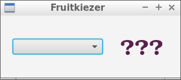
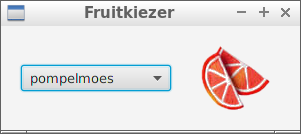

Fruitkiezer
====

We maken het programma na uit de onderstaande afbeeldingen. Het
laat je toe om een stuk fruit (of soms ook een groente) te selecteren en toont
je daar dan een afbeelding van. 

De eerste afbeelding toont je het programma
vlak na het opstarten. De tweede afbeelding toont je hoe alles eruit ziet nadat je
een stuk fruit hebt gekozen.

 &nbsp;&nbsp; 

Maak een nieuw JavaFX-project aan in IntelliJ IDEA. 

IDEA maakt al enkele mappen en bestanden
aan die je zal moeten hernoemen, en waarvan je de inhoud grotendeels zal moeten wissen en/of aanpassen:

* Hernoem de package naar `fruitkiezer`
* Het hoofdprogramma noem je `FruitkiezerMain` of `Main`
* Het FXML-bestand noem je `Fruitkiezer.fxml` 
* De partnerklasse noem je `FruitkiezerCompanion` - in deze cursus gebruiken we liever het woord _companion_
dan _controller_ omdat 'controller' nog veel andere betekenissen heeft.

De user interface bestaat uit een _HBox_ met daarin een _ComboBox_ en een _ImageView_. De _HBox_
kan best marges krijgen (_Insets_) en misschien moet je ook de uitlijning en 
tussenruimtes aanpassen. Gebruik hiervoor de _Scene Builder_.
 
Je kan de afbeeldingen [hier](http://inigem.ugent.be/jvlfx/fruit-afbeeldingen.zip) downloaden. Plaats die
in een deelmap van `fruit` van de `src`-map. Je kan de namen van de verschillende fruitsoorten
van [hieruit](http://inigem.ugent.be/jvlfx/fruitnamen.txt) knippen en plakken. Er is ook een afbeelding
met de naam `unknown.png` voor op het startscherm.

Lees in je programma de afbeeldingen in vanuit het _class path_.
