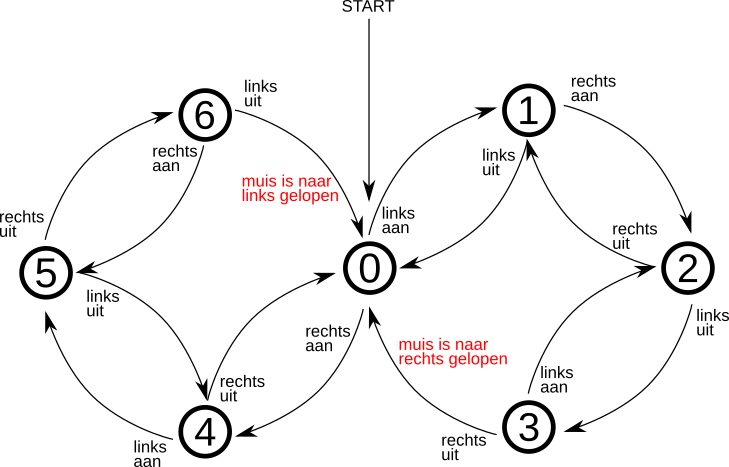
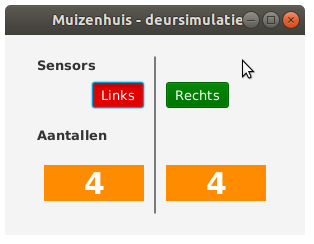

# State Design Pattern

Deze oefening gaat nog maar eens over het 'muizenhuis' waarvan we in het vak *Programmeren*
meerdere versies hebben gemaakt. (Zie [eerdere opgave](https://github.ugent.be/Programmeren-1/Prog-practica-2018-2019/blob/master/muizenhuis/deuren.md).) 
In het bijzonder willen we het overeenkomstige toestandsdiagram implementeren zonder gebruik te maken van
meervoudige selecties (cf. hoofdstuk 2 van de cursus). We passen hierbij een techniek toe die
men het [state design pattern](https://en.wikipedia.org/wiki/State_pattern) noemt.

Vertrek voor deze oefening van het IDEA-project [muizenhuis.zip](muizenhuis.zip?raw=true)

De oefening bestaat erin om de broncode voor de klasse _Toestanden_ in te vullen. 
Je mag de andere bestanden niet wijzigen.

## Methodiek

De toestanden van (de deur) van het muizenhuis zullen we dit keer niet voorstellen als getallen 0..6, maar als 
objecten van verschillende klassen die allemaal aan dezelfde interface *Toestand* voldoen:

    public interface Toestand {
    
        Toestand linksAan(Kamers kamers);
        Toestand linksUit(Kamers kamers);
    
        Toestand rechtsAan(Kamers kamers);
        Toestand rechtsUit(Kamers kamers);
    }
    
Telkens wanneer één van de sensoren een nieuwe waarde krijgt, zal het programma de huidige toestand
aanpassen op de volgende manier:

    this.toestand = this.toestand.linksAan(kamers); 
    
In dit voorbeeld ging de linkersensor 'aan'. Vanzelfsprekend wordt in andere gevallen
één van de andere (overeenkomstige) methoden uit de interface opgeroepen.

Deze methoden retourneren telkens de nieuwe toestand waarin (de deur van) het muizenhuis zich bevindt,
nadat de oude toestand de opgegeven input heeft verwerkt.

De parameter |kamers| voldoet aan een interface die je kan gebruiken om aan te geven of er zojuist
een muis van de ene kamer naar de andere is gelopen - de rode acties in het toestandsdiagram. (Zie interface *Kamers* in het project.)

## Opgave

We geven je een JavaFX-programma cadeau waarmee je jouw implementatie kan testen.

De knoppen 'Links' en 'Rechts' kan je gebruiken om de sensoren te simuleren: ingedrukt (rood)
betekent *aan*, uitgedrukt (groen) betekemt *uit*. Het programma start met 4 muizen in de linkerkamer
en 4 in de rechter. Als je oplossing goed werkt, zullen deze aantallen veranderen wanneer je in de juiste
volgorde op de sensorknoppen klikt.

**Belangrijk!** Je mag enkel wijzigingen aanbrengen aan de klasse _Toestanden_.  Nieuwe klassen die je bijmaakt, moeten
binnenklassen zijn van deze klasse. Lees de bijkomende documentatie in het klassenbestand.         

 

