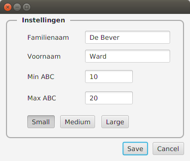
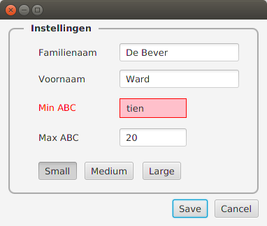
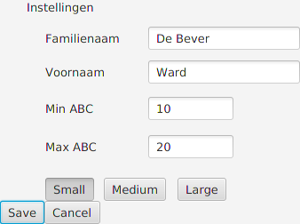

Een GUI voor een eigenschapsbestand
===================================

De eenvoudige GUI die hieronder is afgebeeld, laat toe om de gegevens
aan te passen van een properties-bestand *my.properties* in de
'huidige' directory ( *working directory* ).

Het overeenkomstig properties-bestand heeft de volgende inhoud:

    name=De Bever
    firstName=Ward
	min=10
	max=20
	size=small

Opgave
------
Schrijf een JavaFX-programma (gebaseerd op een FXML-bestand)
waarmee de gebruiker de inhoud van het bestand *my.properties* kan
aanpassen. 

Het programma toont de inhoud van dit bestand op het scherm in de vorm
van een 'formulier'. De gebruiker kan de gegevens in dit formulier
passen. Wanneer hij daarna op de Save-knop drukt, wordt het
properties-bestand overschreven met de nieuwe gegevens en stopt het
programma. (De Cancel-knop doet het programma stoppen zonder het
bestand aan te passen.)

Bijkomende moeilijkheid: wanneer de gegevens voor `min` of `max` geen
gehele getallen zijn als er op de Save-knop wordt gedrukt, dan wordt
het bestand niet overschreven, maar wordt een fout aangegeven in de
GUI - zoals hieronder geïllustreerd:

De GUI
------
Het 'formulier' is als volgt opgebouwd:

* Het geheel is een *BorderPane*
* Onderaan in dit *BorderPane* staat er een *HBox* met daarin de Save-
en de Cancel-knop
* Centraal in dit *BorderPane* staat er een *StackPane* met daarop een
  *AnchorPane* en een label `Instellingen`.
* Het 
*AnchorPane* bevat de 
labels, de tekstvelden en de drie 'schakelknoppen' ( _ToggleButtons_ )
* De drie schakelknoppen horen bij dezelfde *ToggleGroup*: dit zorgt ervoor
  dat er hoogstens één van de drie knoppen tegelijk kan zijn
  ingedrukt. (Opgelet: de Scene Builder kent ook een *Toggle*Button*Group*, maar
   die kan je hier niet gebruiken.)
  
(Het zal nodig zijn om de elektronische documentatie van o.a. *StackPane* en *ToggleGroup* te raadplegen.)
 
Bovenstaande kan je in principe volledig realiseren in een
FXML-bestand, maar in de praktijk zal je wellicht enkele dingen willen
instellen als onderdeel van de *initialize* van de partnerklasse (=
controller-klasse).

Om het formulier er 'mooi' te laten uitzien, zal je ook CSS nodig
hebben. De schermafdruk hierboven, zou er zo uitzien zonder CSS:

Je moet ook CSS gebruiken voor het roodkleuren van de `min`- en `max`-velden in geval van een fout.
